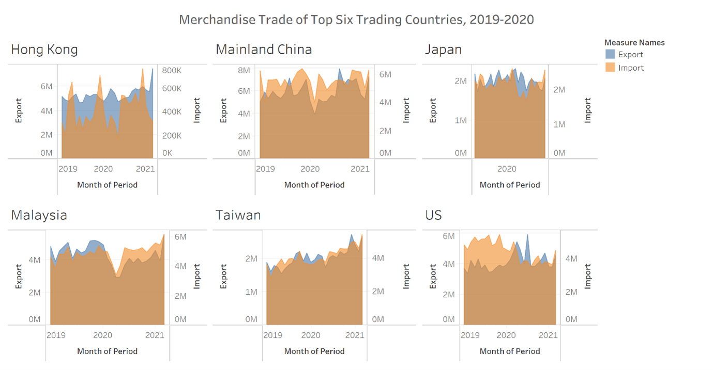

```{r setup, include=FALSE}
knitr::opts_chunk$set(echo = FALSE)
```


## 1 Critique of Visualization 

Original visualization can be seen below: 



### By Aesthetics 

No. | Description of Critique	| Consequence/Remark 
--- | ----------------------- | ------------------------------------------
A1  | The font size of the overall title is smaller than the subtitle of each graph. | The attention is immediately drawn to each country’s names instead of the main title which would tell us what this graph is telling us.
A2  | There is no annotation to convey insights | The visualization just presents a bunch of numbers where audience are unable to make head or tails of. <br> e.g. there is a dip in both exports and imports for Mainland China during 2020 that is likely due to spreading of COVID and annotation should include events like this. 
A3  | Graphs is in a 2 by 3 grid. | Gives the impression that the category splitting the row is different from the category splitting the column which is not true. It also makes it difficult to compare information across countries. 
A4  | There is no order in the placement of countries. | More insights can be derived if we ordered the data in a logical way. 
A5  | Overlapping of area chart colours makes it rather ugly and difficult to read | 

### By Clarity 
No. | Description of Critique	| Consequence/Remark 
--- | ----------------------- | ------------------------------------------
C1  | The width of the x-axis is all different for all countries. | Gives the wrong impression that some countries have more Export/Import based on area. 
C2  | The range of the x-axis is different for Japan, and only shows 2020 on the x-axis | Gives the wrong impression that there is no trade in 2019.
C3  | Within a single subplot, the left and right y-axis have different ranges and scale, resulting in similar heights of area chart between Exports and Imports. | Gives the wrong impression that the amount of Import and Export are around the same for all countries. However, this may not be true. <br> E.g. for Hong Kong, Export ranges below 1 Million while Imports ranges above 4 Million.
C4  | The y-axis across all 6 countries has different scales and ranges resulting in similar heights of area charts across countries. | Gives the wrong impression that trade is consistent across all countries. However, if 2 countries are being compared it is apparent that this is not true. <br> E.g. Hong Kong vs Mainland China, Mainland China has higher amount of Import than Hong Kong 
C5  | The x-axis and y-axis have no tick marks even through it is a quantitative scale. | It makes data difficult to read. 
C6  | Area charts used to represent Export and Import are overlapping. | Area charts are best used for establishing part-to-whole relationship or to exaggerate change. 

## 2 Visualization Makeover 

### Proposed Design 

#### Using a single y-axis

This overcomes the issues raised in C3, C4, 

#### Using stacked area chart 

#### Using Quarters 

### Proposed Visualization (link)

### Step by Step Guide

#### **Loading and Understanding the data**
The Data obtained from the subsection of [Merchandise Trade by Region/Market](https://www.singstat.gov.sg/find-data/search-by-theme/trade-and-investment/merchandise-trade/latest-data ) and was downloaded by clicking on the link Download all in Excel on the same web page. 

Opening the Excel file we see that there are 3 tabs. 
*	Content – describes the content of the data in each page, hence we will not use this sheet. 
* T1 – Merchandise Imports 
*	T2 – Merchandise Exports 


#### Data Preperation

#### Using Tableau to Create Visualization 

## 3 Derived Insights
