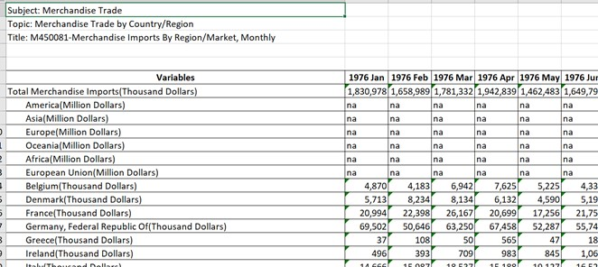

```{r setup, include=FALSE}
knitr::opts_chunk$set(echo = FALSE)
```


## 1 Critique of Visualization 

Original visualization can be seen below: 


### By Aesthetics 

No. | Description of Critique	| Consequence/Remark 
--- | ----------------------- | ------------------------------------------
A1  | The font size of the overall title is smaller than the subtitle of each graph. | The attention is immediately drawn to each country’s names instead of the main title which would tell us what this graph is telling us.
A2  | There is no annotation to convey insights | The visualization just presents a bunch of numbers where audience are unable to make head or tails of. <br> e.g. there is a dip in both exports and imports for Mainland China during 2020 that is likely due to spreading of COVID and annotation should include events like this. 
A3  | Graphs is in a 2 by 3 grid. | Gives the impression that the category splitting the row is different from the category splitting the column which is not true. It also makes it difficult to compare information across countries. 
A4  | There is no order in the placement of countries. | More insights can be derived if we ordered the data in a logical way. 
A5  | Overlapping of area chart colours makes it rather ugly and difficult to read | 

### By Clarity 
No. | Description of Critique	| Consequence/Remark 
--- | ----------------------- | ------------------------------------------
C1  | The width of the x-axis is all different for all countries. | Gives the wrong impression that some countries have more Export/Import based on area. 
C2  | The range of the x-axis is different for Japan, and only shows 2020 on the x-axis | Gives the wrong impression that there is no trade in 2019.
C3  | Within a single subplot, the left and right y-axis have different ranges and scale, resulting in similar heights of area chart between Exports and Imports. | Gives the wrong impression that the amount of Import and Export are around the same for all countries. However, this may not be true. <br> E.g. for Hong Kong, Export ranges below 1 Million while Imports ranges above 4 Million.
C4  | The y-axis across all 6 countries has different scales and ranges resulting in similar heights of area charts across countries. | Gives the wrong impression that trade is consistent across all countries. However, if 2 countries are being compared it is apparent that this is not true. <br> E.g. Hong Kong vs Mainland China, Mainland China has higher amount of Import than Hong Kong 
C5  | The x-axis and y-axis have no tick marks even through it is a quantitative scale. | It makes data difficult to read. 
C6  | Area charts used to represent Export and Import are overlapping. | Area charts are best used for establishing part-to-whole relationship or to exaggerate change. 

## 2 Visualization Makeover 

### Proposed Design

Considering that we want to minimize changes made to the original visualization as much as possible, the visualization has been redesigned as follows: 


Below I will discuss the various key changes that has been made and explain why the changes were made and which critique in the earlier section did these changes overcome: 

#### **Keeping area chart type but stacking them instead. **
As we are looking at Singapore's top 6 merchandise trading partners and not just each countries' export and import, it was decided to use stacked area chart to visualize the merchandise trade (sum of import and export) which shows the part to whole relationship well. Hence, we are also able to see the proportion of import and export relative to the sum of them like how Hong Kong has a very low import but actually has higher overall merchandise trade than that of Japan. This overcomes the issues raised in **_C6_** and **_A5_**.

#### **Using a single y-axis.**
One of the key confusing points in the original design was that the y-axis keeps changing for both imports and exports and for all six countries stated in **_C3_** and **_C4_**. Hence, in the proposed design, merchandise trade of each country shares the same y-axis on the left by placing all 6 countries on the same axis, dividing the visualization into 6 subplots horizontally instead of a 3 by 2 grid (discussed in **_A3_**).  This also makes it easier to compare number across countries.

#### **Countries' merchandise trade are ranked in descending order**
We know the top 6 trading countries, but do we know the country with the highest merchandise trade? Do we know out of the 6 countries, which country has the lowest trade? This was one of the critique made in **_A4_** which we corrected by adding the order in which the countries are placed so that we can see this ranking at a single glance. 

#### **Using Quarterly data instead of monthly data**
Unfortunately, one drawback of using a single y-axis and comparing 6 countries like this in 6 horizontal subplots is that each subplot has limited x-axis space. If we were to show 2 years worth of monthly data, the level of detail shown by the area of chart would be too messy. Keeping in mind that we want to show Singapore's top 6 trading partners across 2 years, it was decided that aggregating to quarterly data is sufficient to show just enough variation across time and yet not over complicate the visualization. 

#### **Consistent x-axis range in each subplot.** 
To solve **_C1_** and **_C2_**, we ensured that the axis in each subplot is of the same width, with the same range starting from 2019 Q1 to 2020 Q4. 

#### **Other fixes**
Other fixes were made such as 

* Ensuring that the visualization title has the largest font (**_A1_**)
* Adding annotations referring to certain portions of the graph to deliver insights more effectively (**_A2_**)
* Ensuring that y-axis and x-axis all have tick marks (**_C5_**)


### Proposed Visualization (link)

### Step by Step Guide

#### **Loading and Understanding the data**
The Data obtained from the subsection of [Merchandise Trade by Region/Market](https://www.singstat.gov.sg/find-data/search-by-theme/trade-and-investment/merchandise-trade/latest-data ) and was downloaded by clicking on the link Download all in Excel on the same web page. 

Opening the Excel file we see that there are 3 tabs. 
*	Content – describes the content of the data in each page, hence we will not use this sheet. 
* T1 – Merchandise Imports 
*	T2 – Merchandise Exports 


On the top and bottom of the tab, there are notes which we would need to remove in our data preparation step. The header row starts from 6th row. There is data with countries represented by row and monthly data represented by columns. Looking at the first few rows, there are also aggregated such as Total Merchandise and regional data such as Asia(Million Dollars) which we will need to remove. Across the columns, we would also only need to extract data from 2019 Jan to 2020 Dec. T2 has a similar structure as T1 and will be prepared in a similar way. 




#### **Data Preparation**
We will be using Tableau Prep Builder to prepare the data and this section will provide a step by step guide to do so. However, each step is explained carefully such that it can also be replicated using alternative means. 

##### Connect to Data Source


#### Create Visualization 
We will be using Tableau Desktop to create the visualization and this section will provide a step by step guide to do so.  

## 3 Derived Insights
