```{r setup, include=FALSE}
knitr::opts_chunk$set(echo = FALSE)
```
## 1 Critique of Visualization 

Original visualization can be seen below: 

```{r, layout="l-body-outset", fig.width=5}

```

The original visualization has its own flaws. We will be critiquing them below: 

### By Aesthetics 

*A1 - A colour representing each partner*: Each partner is represented by a colour which serves no further purpose other than identifying countries. However this is redundant as there are labels identifying them, hence making the visualization colourful without any meaning. We could perhaps make better use of the colour to represent balance of trade thus showing additional information. 

*A2 - bubbles are opaque*: Even though, with some interaction, the 
making the 

*A3 - 


### By Clarity 

*C1. Axis label not on typical side of Axis.*

*C2. Misleading circle size*: When the total trade of one country is double another, the area of circle size is not double, but in fact quadrupled. 

*


## 2 Visualization Makeover 

### Proposed Design

Considering that we want to minimize changes made to the original visualization as much as possible, the visualization has been redesigned as follows: 

# ```{r}
# knitr::include_graphics("img/design_draft.jpg")
# ```

Below I will discuss the various key changes that has been made and explain why the changes were made and which critique in the earlier section did these changes overcome: 

#### **Keeping area chart type but stacking them instead. **
As we are looking at Singapore's top 6 merchandise trading partners and not just each countries' export and import, it was decided to use stacked area chart to visualize the merchandise trade (sum of import and export) which shows the part to whole relationship well. Hence, we are also able to see the proportion of import and export relative to the sum of them like how Hong Kong has a very low import but actually has higher overall merchandise trade than that of Japan. This overcomes the issues raised in [**_C6_**](#by-clarity) and [**_A5_**](#by-aesthetics).

#### **Using a single y-axis.**
One of the key confusing points in the original design was that the y-axis keeps changing for both imports and exports and for all six countries stated in [**_C3_**](#by-clarity) and [**_C4_**](#by-clarity). Hence, in the proposed design, merchandise trade of each country shares the same y-axis on the left by placing all 6 countries on the same axis, dividing the visualization into 6 subplots horizontally instead of a 3 by 2 grid (discussed in [**_A3_**](#by-aesthetics)).  This also makes it easier to compare number across countries.

#### **Countries' merchandise trade are ranked in descending order**
We know the top 6 trading countries, but do we know the country with the highest merchandise trade? Do we know out of the 6 countries, which country has the lowest trade? This was one of the critique made in [**_A4_**](#by-aesthetics) which we corrected by adding the order in which the countries are placed so that we can see this ranking at a single glance. 

#### **Using Quarterly data instead of monthly data**
Unfortunately, one drawback of using a single y-axis and comparing 6 countries like this in 6 horizontal subplots is that each subplot has limited x-axis space. If we were to show 2 years worth of monthly data, the level of detail shown by the area of chart would be too messy. Keeping in mind that we want to show Singapore's top 6 trading partners across 2 years, it was decided that aggregating to quarterly data is sufficient to show just enough variation across time and yet not over complicate the visualization. 

#### **Consistent x-axis range in each subplot.** 
To solve [**_C1_**](#by-clarity) and [**_C2_**](#by-clarity), we ensured that the axis in each subplot is of the same width, with the same range starting from 2019 Q1 to 2020 Q4. 

#### **Other fixes**
Other fixes were made such as 

* Ensuring that the visualization title has the largest font ([**_A1_**](#by-aesthetics))
* Adding annotations referring to certain portions of the graph to deliver insights more effectively [(**_A2_**](#by-aesthetics))
* Ensuring that y-axis and x-axis all have tick marks ([**_C5_**](#by-clarity))


### Proposed Visualization 
The final proposed visualization is as follows: 

# ```{r}
# knitr::include_graphics("img/final.jpg")
# ```

<!-- The visualization can also be access on [Tableau Public](https://public.tableau.com/app/profile/yen.ngee/viz/SingaporeTop6TradingPartners/SGTop6TradingPartners) -->

## 3. Step by Step Guide
In this portion, we will be running through the steps to create the final proposed visualization starting from loading and understanding the data, then we will run through what is done to prepare the data and finally creating the visualization on Tableau. 

### Loading and Understanding the data
The Data obtained from the subsection of [Merchandise Trade by Region/Market](https://www.singstat.gov.sg/find-data/search-by-theme/trade-and-investment/merchandise-trade/latest-data ) and was downloaded by clicking on the link Download all in Excel on the same web page. 

Opening the Excel file we see that there are 3 tabs:

*	Content – describes the content of the data in each page, hence we will not use this sheet. 
* T1 – Merchandise Imports 
*	T2 – Merchandise Exports 

```{r}
knitr::include_graphics("img/step-A1_excel.jpg")
```

On the top and bottom of the tab, there are notes which we would need to remove in our data preparation step. The header row starts from 6th row. There is data with countries represented by row and monthly data represented by columns. Looking at the first few rows, there are also aggregated such as Total Merchandise and regional data such as Asia(Million Dollars) which we will need to remove. Across the columns, we would also only need to extract data from 2019 Jan to 2020 Dec. T2 has a similar structure as T1 and will be prepared in a similar way. 

```{r}
knitr::include_graphics("img/step-A2_T1_top.jpg")
```


```{r}

```

In our proposed visualization, we are looking at both exports and imports in a stacked area chart across time and country. Hence, we will need to prepare the data such that it is in a long format which makes it easier to manipulate in Tableau. The final form of the data should look something like this: 

# ```{r}
# knitr::include_graphics("img/step-A3_T1_final.JPG")
# ```

### Data Preparation
We will be using Tableau Prep Builder to prepare the data. Each step is explained carefully such that it can also be replicated using alternative means. 

#### **Step 1: Connect to Data Source**
After opening Tableau Prep Builder Software, we first need to connect to the Data Source. In this case, we will connect to the excel file that was previously downloaded.

```{r}
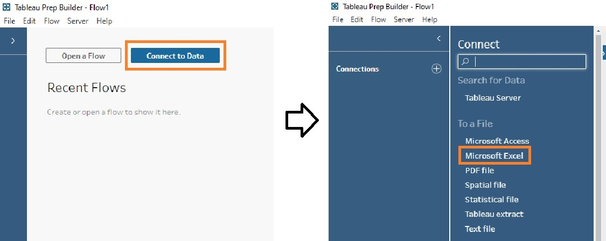
```

#### **Step 2: Add Data to Flow**
In the new interface, drag and drop T1 onto the working space on the right. Tableau Prep Builder will automatically load the data. However, we can see that some of the rows has been captured as notes that we need to delete. Tableau has a handy button on the left called Use `Data Interpreter` which automatically extracts the table data without us having the manually delete the rows. 

```{r}
knitr::include_graphics("img/step-B2_data_interpret.JPG")
```

From there, if we right click on T1, we can choose various steps to treat the data. We will first clean the data. 

```{r}
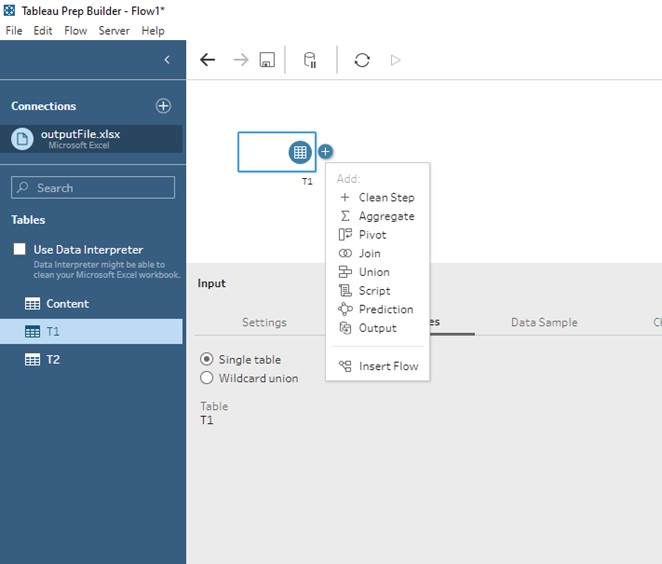
```

#### **Step 3a: Clean T1 - filter the data **
At this step, our data looks like this. 

```{r}
knitr::include_graphics("img/step-B3_before_clean.JPG")
```

As mentioned in Loading and Understanding the data section, we need to exclude the aggregated data. Selecting the first 7 rows until "European Union (Million Dollars)", we can right click and select `Exclude` to exclude these data.  

Note: at this point, we could possibly only keep data from the 10 countries identified in the original visualization with data from the year 2020. However, we choose to keep all of the data so that we can extend the visualization for more possibilities of animation within the visualization. ;) 

```{r}
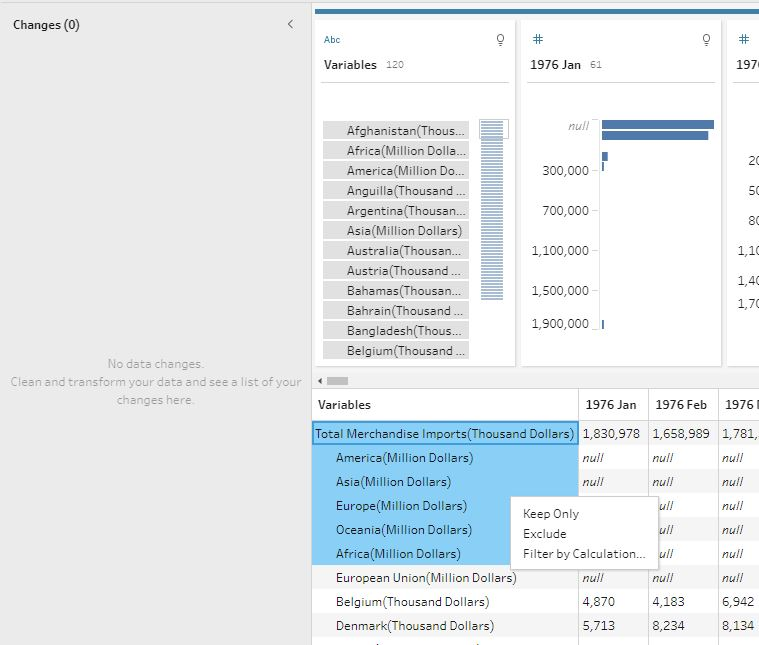
```


#### **Step 3b: Clean T1 - Split column to get country** 

If we look under variables, we know that it is in the format of "white space" + "country name" + "(Thousand Dollars)". We want to only extract the country name, keeping in mind the values are in thousands. Hence, if we click the 3 dots on the column, we can do an `Automatic split` which will split the original column into the variable we want. 

```{r}
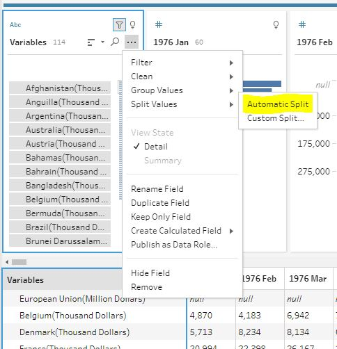
```
The result after the split is the a new column "Variables - Split 1" which contains the Countries' name in the format that we want. The original "Variables" column is then removed by clicking the 3 dots on the column, and selecting remove. "Variables - Split 1" is renamed to to "Country" simply by double clicking on the column name and keying in the new column name. 

The data after this step should look like this:

```{r}
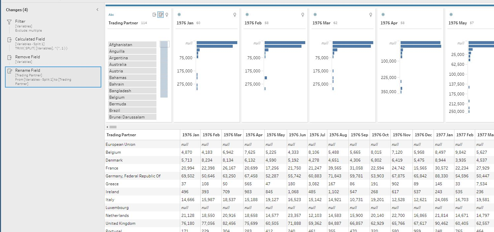
```

#### **Step 4: Pivot T1**
Next, we have to convert all the data in each column and pivot them into rows. To do so, we first select all the columns except for "Country", and click on `Pivot Columns to Rows`.

```{r}
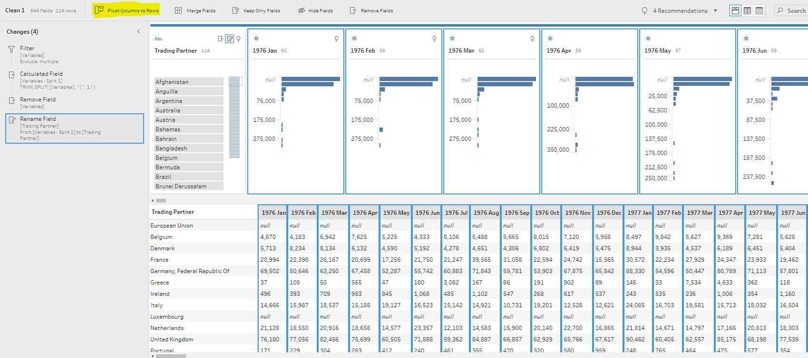
```

This will automatically create a pivot step where they will keep the "Country" as it is and create row with each row containing the value found within the original column. 

```{r} 
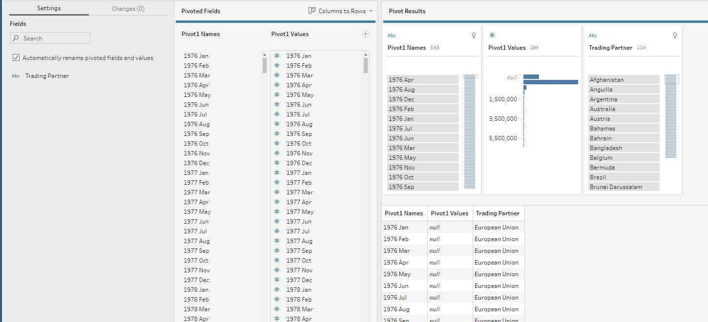
```

#### **Step 5: Create calculated field**
The values, as we noted in step 3b are in thousands. Hence, we need to create a new column to multiply the values by 1000. Click on the 3 dots and select `Create Calculated Field` and then `Custom Calculation`. 

```{r} 

```

A pop up `Add Field` will appear. We key in the name "Imports" and the formula `[Pivot1 Values] * 1000` into the blanks and click `save`. A new column "Imports" will be created. 

We rename "Pivot1 Names" as "Date" and remove "Pivot1 Values" to get:  

```{r} 
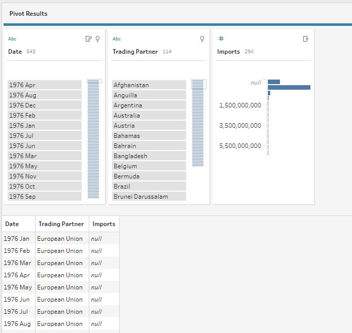
```

Notice that we have kept the null values in. These null values occur with the smaller trading partners. This is because Tableau does show if the visualization contains null values or not and would be a great indication to cross-check the data to understand why there was a null value. 

#### Given that T2 has the same structure as T1, we can repeat steps 2 to 5 for T2, except to name the calculated field after pivoting as "Exports".


#### **Step 5: Join Pivoted T1 and Pivoted T2**
Now we would like to combine the data set. There are different ways of doing this. However, I chose to inner join the two data sets on "Country" and "Date". This means that the data left are countries that must have both imports and exports throughout the years

To do this, we simply drag `Pivot 2` over `Pivot 1` under the join option which will appear when you hover over it. 

```{r} 
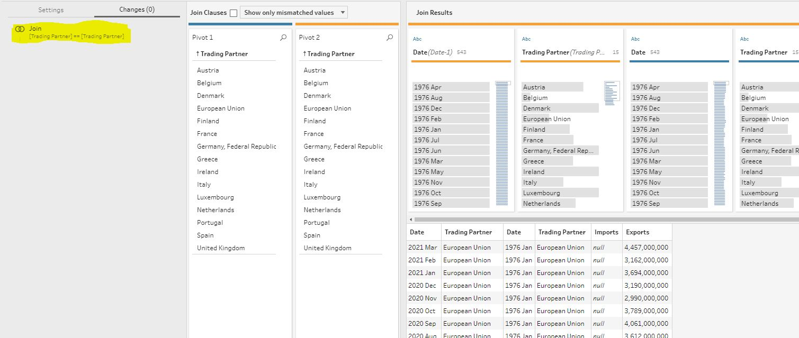
```

Tableau automatically joins the two table on "Country". However, we want the tables to join on both "Country" and "Date". We select `Settings` on the left-hand side, then click on the plus simple on the top right hand of the `Settings` pane. We would be able to add "Date" as a second column to join on. 

```{r} 
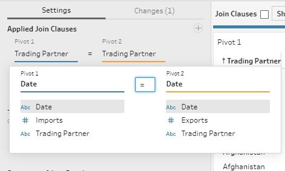
```

We select the venn diagram such that it is completely shaded to select a full outer join. This is so that we keep every data, including data that has imports but no exports and vice versa. 

```{r} 
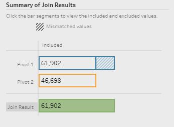
```

#### **Step 6: clean and check data types **
We are almost done! Now what is left, is to check the data type. These are the desired data types of our data:

* "Date" - Date 
* "Country" - String
* "Imports" - Number
* "Exports" - Number

```{r} 

```

We can see that we need to change our "Date" from string to date type. We select the `Abc` just on top of the column name. We can see that the data type is at `String`. We select `Date` to change the data type. 

```{r} 

```

#### **Step 8: Output**
For an output, we create an output node to output the data. Selecting the folder and file name we want to save as, and clicking `Run Flow`, we create a .hyper extract which we would be using for creating our visualization. 


